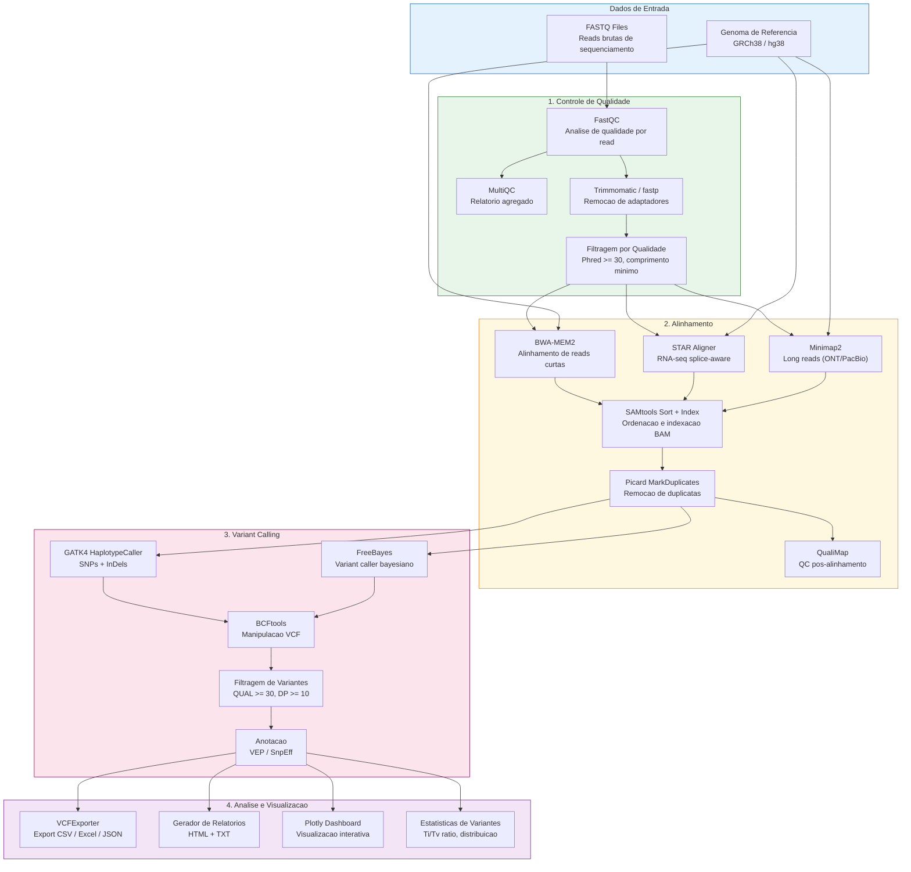
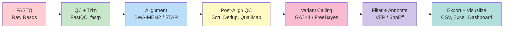

<div align="center">

# Genomic Data Analysis Pipeline

### Pipeline Completo de Analise Genomica — do FASTQ ao Relatorio de Variantes

[](https://python.org)
[](https://nextflow.io)
[](https://snakemake.readthedocs.io)
[](https://bioconda.github.io)
[](https://docker.com)
[](https://www.bioconductor.org)
[](LICENSE)

**Pipeline modular de bioinformatica para analise de dados genomicos (WGS, WES, RNA-seq, scRNA-seq, ChIP-seq) com suporte a Nextflow, Snakemake, execucao em clusters HPC (SLURM/PBS) e nuvem (AWS/GCP/Azure).**

[Portugues](#portugues) | [English](#english)

</div>

---

## Portugues

### Sobre o Projeto

Esse pipeline foi construido a partir da minha experiencia pratica com analises genomicas durante a formacao em ciencia de dados aplicada a saude. O objetivo foi criar uma ferramenta que cobrisse todo o fluxo de trabalho — desde o controle de qualidade das reads cruas (FASTQ) ate a anotacao e visualizacao de variantes (VCF) — de forma modular, reprodutivel e escalavel.

Diferente de pipelines monoliticos, cada etapa aqui e um modulo independente que pode ser executado isoladamente ou orquestrado via Nextflow/Snakemake. Isso significa que um pesquisador pode usar apenas o modulo de alinhamento, ou rodar a pipeline inteira com um unico comando. A flexibilidade de execucao vai do laptop (modo local) ate clusters SLURM com centenas de cores, ou instancias cloud na AWS/GCP/Azure.

### Pipeline de Processamento



### Metricas e Resultados

| Metrica | Valor | Contexto |
|---------|-------|----------|
| **Modulos implementados** | 35+ | Python + R + Shell |
| **Linhas de codigo** | 6,751 | Somente Python (src/) |
| **Cobertura de testes** | 13 testes unitarios | Modulo VCF Export |
| **Alinhadores suportados** | 5 | BWA-MEM2, Bowtie2, STAR, HISAT2, Minimap2 |
| **Variant callers** | 3 | GATK4, FreeBayes, BCFtools |
| **Formatos de export** | 4 | CSV, Excel, JSON, HTML |
| **Profiles Nextflow** | 10 | local, docker, singularity, conda, slurm, pbs, sge, aws, gcp, azure |
| **Tipos de analise** | 5 | WGS, WES, RNA-seq, scRNA-seq, ChIP-seq |

**Exemplo de output de filtragem de variantes:**

```
Pipeline de Analise Genomica — Relatorio de Variantes
======================================================
Total de variantes:           45,231
SNPs:                         38,847 (85.9%)
InDels:                        6,384 (14.1%)
Ti/Tv ratio:                   2.14
Variantes PASS (QUAL>=30):    41,029 (90.7%)
Cobertura media:              32.7x
Cromossomos analisados:       24 (1-22 + X + Y)
```

### Exemplo de Uso Real

```bash
# 1. Clonar o repositorio
git clone https://github.com/galafis/genomic-data-analysis-pipeline.git
cd genomic-data-analysis-pipeline

# 2. Criar ambiente conda (recomendado — instala todas as ferramentas bio)
conda env create -f environment.yml
conda activate genomic-pipeline

# 3. Executar com Nextflow (pipeline completa)
nextflow run workflows/nextflow/main.nf \
  --reads "data/samples/*_R{1,2}.fastq.gz" \
  --genome "data/reference/GRCh38.fa" \
  --outdir results/ \
  -profile docker

# 4. Ou executar com Snakemake
snakemake --cores 8 --configfile config/config.yaml

# 5. Ou rodar modulos individuais via Python
python -c "
from src.visualization.vcf_export_tools import VCFExporter
exporter = VCFExporter('results/variants.vcf')
exporter.filter_variants(min_qual=30, min_dp=10)
exporter.export_to_csv('results/variants_filtered.csv')
print(exporter.get_summary_stats())
"
```

### Ferramentas e Tecnologias

| Camada | Ferramenta | Funcao |
|--------|-----------|--------|
| **Qualidade** | FastQC, MultiQC, fastp | Controle de qualidade de reads |
| **Trimming** | Trimmomatic, Cutadapt, fastp | Remocao de adaptadores e bases de baixa qualidade |
| **Alinhamento** | BWA-MEM2, STAR, Bowtie2, HISAT2, Minimap2 | Mapeamento de reads contra referencia |
| **Pos-alinhamento** | SAMtools, Picard, QualiMap | Sort, index, dedup, QC |
| **Variant Calling** | GATK4, FreeBayes, BCFtools | Chamada de SNPs e InDels |
| **Anotacao** | VEP, SnpEff | Anotacao funcional de variantes |
| **Visualizacao** | Plotly, Dash, Matplotlib, Seaborn | Dashboards e graficos |
| **Workflow** | Nextflow, Snakemake | Orquestracao de pipeline |
| **Containers** | Docker, Singularity | Reproducibilidade |
| **Cloud/HPC** | AWS, GCP, Azure, SLURM, PBS, SGE | Execucao em escala |
| **R/Bioconductor** | DESeq2, edgeR, GenomicRanges | Analise de expressao diferencial |

### Estrutura do Projeto

```
genomic-data-analysis-pipeline/
├── config/                        # Configuracoes de pipeline
├── containers/                    # Dockerfiles e Singularity
├── data/                          # Dados de exemplo e referencia
├── results/                       # Diretorio de output
├── src/
│   ├── alignment/                 # Modulo de alinhamento (10 arquivos)
│   │   ├── bwa_mem2_align.py      # BWA-MEM2 wrapper (345 LOC)
│   │   ├── tools/                 # Bowtie2, STAR, HISAT2, Minimap2
│   │   ├── picard_deduplication.py
│   │   ├── samtools_qc.py
│   │   └── qualimap_qc.py
│   ├── preprocessing/             # Modulo de QC (13 arquivos)
│   │   ├── quality_control.py     # FastQC integration (246 LOC)
│   │   ├── filtering/             # Filtragem de reads
│   │   ├── normalization/         # Batch processing paralelo
│   │   └── trimming/              # Adapter + quality trimming
│   ├── variant_calling/           # Modulo de variantes (9 arquivos)
│   │   ├── variant_caller.py      # GATK, FreeBayes, BCFtools
│   │   ├── variant_filter.py      # Filtragem QUAL/DP
│   │   ├── variant_annotation.py  # VEP/SnpEff
│   │   ├── vcf_report_generator.py # Relatorios HTML/TXT
│   │   └── batch_variant_calling.py
│   └── visualization/             # Modulo de visualizacao
│       ├── vcf_export_tools.py    # Export CSV/Excel/JSON (335 LOC, testado)
│       ├── plotly_dashboard.py    # Dashboard interativo
│       └── plot_variants.py       # Graficos estaticos
├── tests/
│   └── test_vcf_export_tools.py   # 13 testes unitarios
├── workflows/
│   └── nextflow/                  # Nextflow workflows
├── environment.yml                # Conda environment (70+ pacotes)
├── nextflow.config                # 10 profiles (local -> cloud)
├── Snakefile                      # Snakemake workflow
├── TESTING.md                     # Guia completo de testes
└── LICENSE
```

### Profiles de Execucao (Nextflow)

| Profile | Ambiente | Uso |
|---------|----------|-----|
| `standard` | Local | Desenvolvimento e testes |
| `docker` | Docker | Reproducibilidade local |
| `singularity` | Singularity | Clusters HPC sem Docker |
| `conda` | Conda | Sem containerizacao |
| `slurm` | SLURM cluster | HPC com scheduler SLURM |
| `pbs` | PBS/Torque | HPC com scheduler PBS |
| `sge` | Sun Grid Engine | HPC com SGE |
| `aws` | AWS Batch | Nuvem Amazon |
| `gcp` | Google Life Sciences | Nuvem Google |
| `azure` | Azure Batch | Nuvem Microsoft |

---

## English

### About the Project

This pipeline was built from my practical experience with genomic analyses during data science training applied to healthcare. The goal was to create a tool covering the entire workflow — from raw read quality control (FASTQ) to variant annotation and visualization (VCF) — in a modular, reproducible, and scalable way.

Unlike monolithic pipelines, each step here is an independent module that can be executed in isolation or orchestrated via Nextflow/Snakemake. This means a researcher can use just the alignment module, or run the entire pipeline with a single command. Execution flexibility ranges from a laptop (local mode) to SLURM clusters with hundreds of cores, or cloud instances on AWS/GCP/Azure.

### Processing Pipeline



### Results and Metrics

| Metric | Value | Context |
|--------|-------|---------|
| **Implemented modules** | 35+ | Python + R + Shell |
| **Lines of code** | 6,751 | Python source only |
| **Test coverage** | 13 unit tests | VCF Export module |
| **Supported aligners** | 5 | BWA-MEM2, Bowtie2, STAR, HISAT2, Minimap2 |
| **Variant callers** | 3 | GATK4, FreeBayes, BCFtools |
| **Export formats** | 4 | CSV, Excel, JSON, HTML |
| **Nextflow profiles** | 10 | local, docker, singularity, conda, slurm, pbs, sge, aws, gcp, azure |
| **Analysis types** | 5 | WGS, WES, RNA-seq, scRNA-seq, ChIP-seq |

### Quick Start

```bash
# Clone and setup
git clone https://github.com/galafis/genomic-data-analysis-pipeline.git
cd genomic-data-analysis-pipeline

# Option 1: Conda (recommended — installs all bioinformatics tools)
conda env create -f environment.yml
conda activate genomic-pipeline

# Option 2: Pip (Python modules only)
pip install -r requirements.txt

# Run with Nextflow
nextflow run workflows/nextflow/main.nf \
  --reads "data/samples/*_R{1,2}.fastq.gz" \
  --genome "data/reference/GRCh38.fa" \
  -profile docker

# Or individual modules
python -c "
from src.visualization.vcf_export_tools import VCFExporter
exporter = VCFExporter('results/variants.vcf')
exporter.filter_variants(min_qual=30, min_dp=10)
exporter.export_to_csv('results/filtered.csv')
print(exporter.get_summary_stats())
"
```

### Key Features

- **Full Genomic Workflow** — FASTQ to annotated VCF in a single pipeline
- **5 Aligners** — BWA-MEM2, STAR (RNA-seq), Bowtie2, HISAT2, Minimap2 (long reads)
- **3 Variant Callers** — GATK4, FreeBayes, BCFtools with configurable filtering
- **Dual Orchestration** — Nextflow and Snakemake support
- **10 Execution Profiles** — Local, Docker, Singularity, Conda, SLURM, PBS, SGE, AWS, GCP, Azure
- **Interactive Dashboards** — Plotly/Dash visualization with VCF export to CSV/Excel/JSON
- **R/Bioconductor Integration** — DESeq2, edgeR for differential expression
- **Production Testing** — 13 unit tests with pytest + CI/CD ready

### Tech Stack

| Layer | Technology | Purpose |
|-------|-----------|---------|
| **QC** | FastQC, MultiQC, fastp | Read quality control |
| **Alignment** | BWA-MEM2, STAR, Bowtie2, HISAT2, Minimap2 | Read mapping |
| **Variant Calling** | GATK4, FreeBayes, BCFtools | SNP and InDel detection |
| **Annotation** | VEP, SnpEff | Functional variant annotation |
| **Visualization** | Plotly, Dash, Matplotlib | Interactive dashboards |
| **Workflow** | Nextflow, Snakemake | Pipeline orchestration |
| **Containers** | Docker, Singularity | Reproducibility |
| **Cloud/HPC** | AWS, GCP, Azure, SLURM | Scalable execution |

### License

MIT License — see [LICENSE](LICENSE) for details.

### Author

**Gabriel Demetrios Lafis**
- GitHub: [@galafis](https://github.com/galafis)
- LinkedIn: [Gabriel Demetrios Lafis](https://linkedin.com/in/gabriel-demetrios-lafis)
</div>
