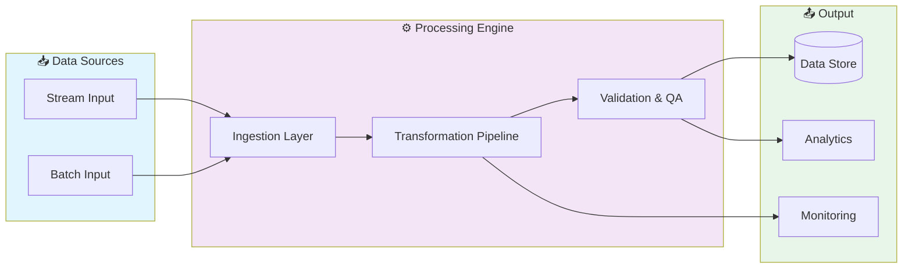
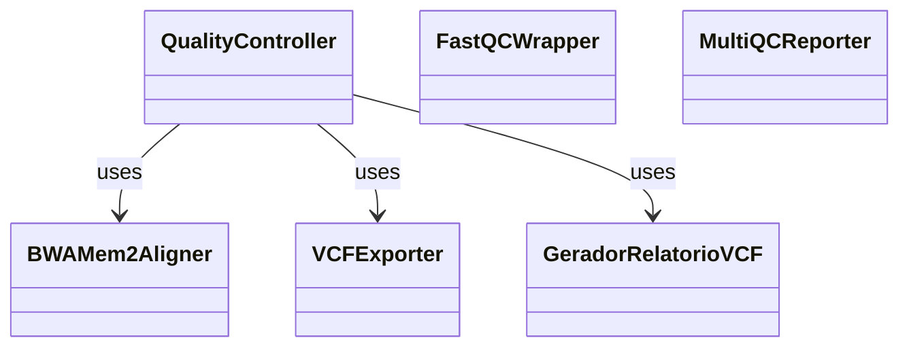

# 📊 Genomic Data Analysis Pipeline

> Advanced data science project: genomic-data-analysis-pipeline

[](https://img.shields.io/badge/)
[](LICENSE)

[English](#english) | [Português](#português)

---

## English

### 🎯 Overview

**Genomic Data Analysis Pipeline** is a production-grade Python application complemented by R, Shell that showcases modern software engineering practices including clean architecture, comprehensive testing, containerized deployment, and CI/CD readiness.

The codebase comprises **9,209 lines** of source code organized across **46 modules**, following industry best practices for maintainability, scalability, and code quality.

### ✨ Key Features

- **🔄 Data Pipeline**: Scalable ETL with parallel processing
- **✅ Data Validation**: Schema validation and quality checks
- **📊 Monitoring**: Pipeline health metrics and alerting
- **🔧 Configurability**: YAML/JSON-based pipeline configuration
- **🏗️ Object-Oriented**: 6 core classes with clean architecture

### 🏗️ Architecture





### 🚀 Quick Start

#### Prerequisites

- Python 3.12+
- pip (Python package manager)

#### Installation

```bash
# Clone the repository
git clone https://github.com/galafis/genomic-data-analysis-pipeline.git
cd genomic-data-analysis-pipeline

# Create and activate virtual environment
python -m venv venv
source venv/bin/activate  # On Windows: venv\Scripts\activate

# Install dependencies
pip install -r requirements.txt
```

#### Running

```bash
# Run the application
python src/main.py
```

### 🧪 Testing

```bash
# Run all tests
pytest

# Run with coverage report
pytest --cov --cov-report=html

# Run specific test module
pytest tests/test_main.py -v

# Run with detailed output
pytest -v --tb=short
```

### 📁 Project Structure

```
genomic-data-analysis-pipeline/
├── assets/
├── config/        # Configuration
│   └── README.md
├── containers/
│   └── README.md
├── data/
│   └── README.md
├── docs/          # Documentation
│   └── README.md
├── results/
│   └── README.md
├── scripts/
│   └── README.md
├── src/          # Source code
│   ├── alignment/
│   │   ├── benchmarks/
│   │   ├── protocols/
│   │   ├── tools/
│   │   ├── README.md
│   │   └── bwa_mem2_align.py
│   ├── annotation/
│   │   └── README.md
│   ├── preprocessing/
│   │   ├── filtering/
│   │   ├── normalization/
│   │   ├── quality_control/
│   │   ├── trimming/
│   │   ├── README.md
│   │   └── quality_control.py
│   ├── scripts/
│   │   └── README.md
│   ├── src/          # Source code
│   │   └── variant_calling/
│   ├── variant_calling/
│   │   ├── README.md
│   │   ├── README_batch.md
│   │   ├── batch_troubleshooting.md
│   │   ├── batch_variant_calling.py
│   │   ├── qc_variant_stats.py
│   │   ├── variant_annotation.py
│   │   ├── variant_batch_summary.py
│   │   ├── variant_caller.py
│   │   ├── variant_calling_protocol.md
│   │   ├── variant_filter.py
│   │   ├── vcf_report_generator.py
│   │   └── vcf_visualization.py
│   ├── visualization/
│   │   ├── interactive/
│   │   ├── README.md
│   │   └── plot_variants.py
│   ├── workflows/
│   │   ├── nextflow/
│   │   └── README.md
│   └── README.md
├── tests/         # Test suite
│   ├── README.md
│   └── test_vcf_export_tools.py
├── workflows/
│   ├── nextflow/
│   └── README.md
├── LICENSE
├── README.md
├── TESTING.md
└── environment.yml
```

### 🛠️ Tech Stack

| Technology | Description | Role |
|------------|-------------|------|
| **Python** | Core Language | Primary |
| Shell | 10 files | Supporting |
| R | 1 files | Supporting |

### 🤝 Contributing

Contributions are welcome! Please feel free to submit a Pull Request. For major changes, please open an issue first to discuss what you would like to change.

1. Fork the project
2. Create your feature branch (`git checkout -b feature/AmazingFeature`)
3. Commit your changes (`git commit -m 'Add some AmazingFeature'`)
4. Push to the branch (`git push origin feature/AmazingFeature`)
5. Open a Pull Request

### 📄 License

This project is licensed under the MIT License - see the [LICENSE](LICENSE) file for details.

### 👤 Author

**Gabriel Demetrios Lafis**
- GitHub: [@galafis](https://github.com/galafis)
- LinkedIn: [Gabriel Demetrios Lafis](https://linkedin.com/in/gabriel-demetrios-lafis)

---

## Português

### 🎯 Visão Geral

**Genomic Data Analysis Pipeline** é uma aplicação Python de nível profissional, complementada por R, Shell que demonstra práticas modernas de engenharia de software, incluindo arquitetura limpa, testes abrangentes, implantação containerizada e prontidão para CI/CD.

A base de código compreende **9,209 linhas** de código-fonte organizadas em **46 módulos**, seguindo as melhores práticas do setor para manutenibilidade, escalabilidade e qualidade de código.

### ✨ Funcionalidades Principais

- **🔄 Data Pipeline**: Scalable ETL with parallel processing
- **✅ Data Validation**: Schema validation and quality checks
- **📊 Monitoring**: Pipeline health metrics and alerting
- **🔧 Configurability**: YAML/JSON-based pipeline configuration
- **🏗️ Object-Oriented**: 6 core classes with clean architecture

### 🏗️ Arquitetura


### 🚀 Início Rápido

#### Prerequisites

- Python 3.12+
- pip (Python package manager)

#### Installation

```bash
# Clone the repository
git clone https://github.com/galafis/genomic-data-analysis-pipeline.git
cd genomic-data-analysis-pipeline

# Create and activate virtual environment
python -m venv venv
source venv/bin/activate  # On Windows: venv\Scripts\activate

# Install dependencies
pip install -r requirements.txt
```

#### Running

```bash
# Run the application
python src/main.py
```

### 🧪 Testing

```bash
# Run all tests
pytest

# Run with coverage report
pytest --cov --cov-report=html

# Run specific test module
pytest tests/test_main.py -v

# Run with detailed output
pytest -v --tb=short
```

### 📁 Estrutura do Projeto

```
genomic-data-analysis-pipeline/
├── assets/
├── config/        # Configuration
│   └── README.md
├── containers/
│   └── README.md
├── data/
│   └── README.md
├── docs/          # Documentation
│   └── README.md
├── results/
│   └── README.md
├── scripts/
│   └── README.md
├── src/          # Source code
│   ├── alignment/
│   │   ├── benchmarks/
│   │   ├── protocols/
│   │   ├── tools/
│   │   ├── README.md
│   │   └── bwa_mem2_align.py
│   ├── annotation/
│   │   └── README.md
│   ├── preprocessing/
│   │   ├── filtering/
│   │   ├── normalization/
│   │   ├── quality_control/
│   │   ├── trimming/
│   │   ├── README.md
│   │   └── quality_control.py
│   ├── scripts/
│   │   └── README.md
│   ├── src/          # Source code
│   │   └── variant_calling/
│   ├── variant_calling/
│   │   ├── README.md
│   │   ├── README_batch.md
│   │   ├── batch_troubleshooting.md
│   │   ├── batch_variant_calling.py
│   │   ├── qc_variant_stats.py
│   │   ├── variant_annotation.py
│   │   ├── variant_batch_summary.py
│   │   ├── variant_caller.py
│   │   ├── variant_calling_protocol.md
│   │   ├── variant_filter.py
│   │   ├── vcf_report_generator.py
│   │   └── vcf_visualization.py
│   ├── visualization/
│   │   ├── interactive/
│   │   ├── README.md
│   │   └── plot_variants.py
│   ├── workflows/
│   │   ├── nextflow/
│   │   └── README.md
│   └── README.md
├── tests/         # Test suite
│   ├── README.md
│   └── test_vcf_export_tools.py
├── workflows/
│   ├── nextflow/
│   └── README.md
├── LICENSE
├── README.md
├── TESTING.md
└── environment.yml
```

### 🛠️ Stack Tecnológica

| Tecnologia | Descrição | Papel |
|------------|-----------|-------|
| **Python** | Core Language | Primary |
| Shell | 10 files | Supporting |
| R | 1 files | Supporting |

### 🤝 Contribuindo

Contribuições são bem-vindas! Sinta-se à vontade para enviar um Pull Request.

### 📄 Licença

Este projeto está licenciado sob a Licença MIT - veja o arquivo [LICENSE](LICENSE) para detalhes.

### 👤 Autor

**Gabriel Demetrios Lafis**
- GitHub: [@galafis](https://github.com/galafis)
- LinkedIn: [Gabriel Demetrios Lafis](https://linkedin.com/in/gabriel-demetrios-lafis)
