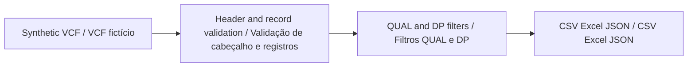

# Genomic Variant Export Pipeline

### Pipeline de Exportação de Variantes Genômicas

[](https://github.com/galafis/genomic-data-analysis-pipeline/actions/workflows/ci.yml)
[English](#english) · [Português](#portugues) · [Examples / Exemplos](examples/review_demo.py) · [Validation / Validação](docs/VALIDATION.md)

**Bioinformatics / Bioinformática** · Working prototype / Protótipo funcional · Gabriel Demetrios Lafis

<a id="english"></a>

## English

Parse the fixed columns of an uncompressed VCF file, filter variants by quality and depth, and export the resulting table to CSV, Excel or JSON.

### What works

- Strict fixed-column parsing with line-numbered errors and an explicit #CHROM header.
- Missing QUAL and INFO/DP remain missing; records with missing values do not satisfy minimum thresholds.
- Header-only files retain a stable schema; summary JSON uses null for unavailable statistics.

### Reproducible walkthrough

Requirements: Python 3.12 / Python 3.12.

Run from the repository root. The validation environment installs the components exercised by the tests and documented example; optional integrations may need their separate dependencies.

```sh
python -m venv .venv
# Activate .venv for your shell / Ative .venv no seu terminal
python -m pip install -r requirements-validation.txt
python -m pytest -q
python -m examples.review_demo
```

**Input contract / Contrato de entrada:** Uncompressed VCF fixed columns / colunas fixas VCF não comprimido; `INFO/DP` is site depth / profundidade do sítio.

**Expected behavior / Comportamento esperado:** At QUAL ≥ 30 and DP ≥ 10, demo-1 and demo-4 remain. / Com QUAL ≥ 30 e DP ≥ 10, permanecem demo-1 e demo-4.

### Architecture / Arquitetura


```mermaid
flowchart LR
    A["Synthetic VCF / VCF fictício"]
    B["Header and record validation / Validação de cabeçalho e registros"]
    C["QUAL and DP filters / Filtros QUAL e DP"]
    D["CSV Excel JSON / CSV Excel JSON"]
    A --> B --> C --> D
```

The main path can be followed in [src/visualization/interactive/vcf_export_tools.py](src/visualization/interactive/vcf_export_tools.py). Examples call the actual implementation and include assertions; they are not pseudocode.

### Scope and assumptions

The reviewed path is VCF parsing, filtering and export. Other directories contain external-tool wrappers and workflow experiments; full sequencing, alignment and variant-calling pipelines were not executed in this review. This parser does not interpret genotype FORMAT fields, normalize variants or assign clinical significance.

### Changes verified in this review

Handled missing depth and empty datasets; rejected malformed records and invalid export names; corrected two test expectations to match actual fixture depth and pandas integer types.

<a id="portugues"></a>

## Português

Leia as colunas fixas de um VCF não comprimido, filtre variantes por qualidade e profundidade e exporte a tabela para CSV, Excel ou JSON.

### Funcionalidades disponíveis

- Leitura das colunas fixas com erros que indicam a linha e exigência explícita do cabeçalho #CHROM.
- QUAL e INFO/DP ausentes permanecem ausentes; registros sem valores não atendem aos filtros mínimos.
- Arquivos com apenas cabeçalho mantêm esquema estável; estatísticas indisponíveis usam null no JSON.

### Execução reproduzível

Use os comandos da seção acima a partir da raiz do repositório. Requisitos: Python 3.12 / Python 3.12. O ambiente de validação instala os componentes exercitados pelos testes e pelo exemplo documentado; integrações opcionais podem exigir dependências próprias.

O fluxo principal está em [src/visualization/interactive/vcf_export_tools.py](src/visualization/interactive/vcf_export_tools.py). Os exemplos usam a implementação real e verificam resultados com asserções; não são pseudocódigo. O diagrama apresenta os mesmos passos nos dois idiomas.

### Escopo e premissas

O caminho revisado é leitura, filtragem e exportação de VCF. Outros diretórios contêm integrações com ferramentas externas e experimentos de workflow; sequenciamento, alinhamento e chamada de variantes completos não foram executados nesta revisão. O leitor não interpreta FORMAT de genótipos, normaliza variantes ou atribui significado clínico.

### Melhorias verificadas nesta revisão

Tratados profundidade ausente e conjuntos vazios; rejeitados registros malformados e nomes de exportação inválidos; corrigidas duas expectativas de testes para os dados da amostra e inteiros pandas.

### Export the supplied fixture / Exportar a amostra fornecida

```sh
python -m src.visualization.interactive.vcf_export_tools examples/sample.vcf --output-dir output --min-qual 30 --min-dp 10
```

EN: Creates `output/variants.csv` and `output/variants.json`. The minimum filters exclude missing values. Chromosome filtering is available through the Python API.

PT: Cria `output/variants.csv` e `output/variants.json`. Os filtros mínimos excluem valores ausentes. A API Python também oferece filtro por cromossomo.

## Repository guide / Guia do repositório

| Location / Local                                                                    | Purpose / Finalidade                                                   |
| ----------------------------------------------------------------------------------- | ---------------------------------------------------------------------- |
| [Implementation / Implementação](src/visualization/interactive/vcf_export_tools.py) | Main domain behavior / Comportamento principal do domínio              |
| [Example / Exemplo](examples/review_demo.py)                                        | Executable scenario / Cenário executável                               |
| [Tests / Testes](tests/)                                                            | Normal behavior and failure cases / Fluxos válidos e casos de falha    |
| [Validation notes / Notas de validação](docs/VALIDATION.md)                         | Corrections, evidence and boundaries / Correções, evidências e limites |
| [Workflow / Automação](.github/workflows/ci.yml)                                    | Automated checks / Verificações automatizadas                          |

- [Executed example result / Resultado executado do exemplo](examples/expected.json)

## Development / Desenvolvimento

EN: When changing behavior, update the contract, the worked example and a regression test together. Keep synthetic fixtures separate from real data. A passing test suite demonstrates the listed software behaviors; it does not certify a deployment or domain outcome.

PT: Ao alterar comportamento, atualize em conjunto o contrato, o exemplo e um teste de regressão. Separe amostras fictícias de dados reais. Testes aprovados demonstram os comportamentos de software listados; não certificam implantação nem resultado no domínio.

Author / Autor: [Gabriel Demetrios Lafis](https://github.com/galafis) · [Institutional contact / Contato institucional](mailto:gabrieldemetrioslafis@usp.br)

License / Licença: [repository license](LICENSE).
