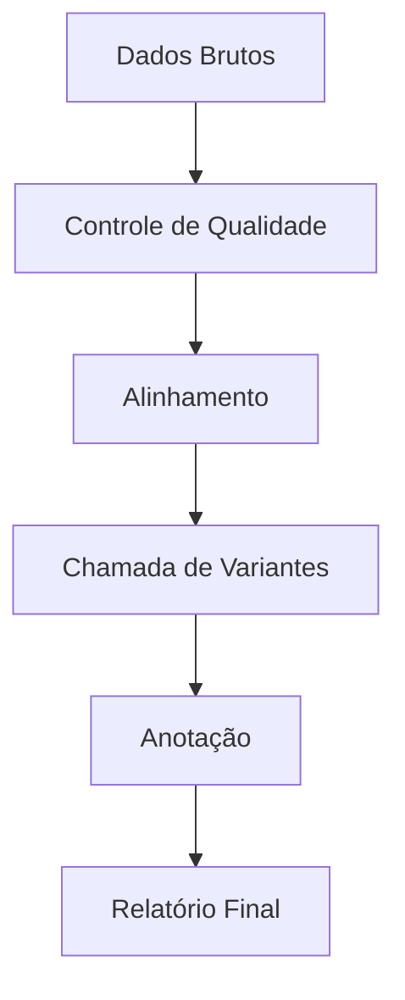

# 📚 Documentação Técnica

## Pipeline de Análise de Dados Genômicos

> **Guia Abrangente da Documentação Técnica do Sistema**

---

## 🎯 Visão Geral

Este diretório contém toda a documentação técnica do **Genomic Data Analysis Pipeline**, organizada de forma estruturada para facilitar a navegação e compreensão do sistema. A documentação segue padrões profissionais e está constantemente atualizada para refletir as funcionalidades mais recentes.

### 🔍 Propósito da Documentação

- **Orientação Técnica**: Guias detalhados para desenvolvedores e usuários
- **Padronização**: Estabelecimento de convenções e boas práticas
- **Manutenibilidade**: Facilitar atualizações e contribuições
- **Acessibilidade**: Tornar o conhecimento disponível para toda a equipe

---

## 📂 Estrutura da Documentação

```
docs/
├── 📁 installation/          # Guias de instalação e configuração
│   ├── requirements.md       # Requisitos do sistema
│   ├── setup-guide.md        # Instalação passo a passo
│   ├── docker-setup.md       # Configuração via Docker
│   └── troubleshooting.md    # Solução de problemas de instalação
│
├── 📁 user-guide/            # Manuais do usuário
│   ├── getting-started.md    # Primeiros passos
│   ├── basic-workflows.md    # Fluxos básicos de trabalho
│   ├── advanced-features.md  # Funcionalidades avançadas
│   └── best-practices.md     # Melhores práticas de uso
│
├── 📁 developer-guide/       # Documentação para desenvolvedores
│   ├── architecture.md       # Arquitetura do sistema
│   ├── contributing.md       # Guia de contribuição
│   ├── coding-standards.md   # Padrões de codificação
│   └── testing-guide.md      # Estratégias de teste
│
├── 📁 api/                   # Documentação da API
│   ├── endpoints.md          # Endpoints disponíveis
│   ├── authentication.md    # Sistema de autenticação
│   ├── data-models.md        # Modelos de dados
│   └── examples.md           # Exemplos de uso da API
│
├── 📁 workflows/             # Fluxos de trabalho específicos
│   ├── quality-control.md    # Controle de qualidade
│   ├── variant-calling.md    # Chamada de variantes
│   ├── annotation.md         # Anotação genômica
│   └── visualization.md      # Visualização de dados
│
├── 📁 examples/              # Exemplos práticos
│   ├── sample-datasets.md    # Conjuntos de dados de exemplo
│   ├── use-cases.md          # Casos de uso comuns
│   └── tutorials.md          # Tutoriais step-by-step
│
└── 📁 troubleshooting/       # Solução de problemas
    ├── common-issues.md      # Problemas frequentes
    ├── error-codes.md        # Códigos de erro
    └── performance.md        # Otimização de performance
```

---

## 📝 Padrões de Documentação

### 🎨 Estilo Visual

- **Emojis Temáticos**: 🧬 (DNA), 📊 (Análise), ⚡ (Performance), 🔬 (Ciência)
- **Código em Blocos**: Uso de syntax highlighting para melhor legibilidade
- **Diagramas**: Mermaid.js para fluxogramas e arquiteturas
- **Tabelas**: Formatação consistente para dados estruturados

### 📏 Convenções de Nomenclatura

#### Arquivos
- **Formato**: `kebab-case.md` (ex: `variant-calling.md`)
- **Prefixos**: Usar prefixos descritivos quando necessário
- **Idioma**: Português para documentação interna, inglês para APIs

#### Seções
```markdown
# 📚 Título Principal (H1)
## 🎯 Seção Principal (H2)
### 🔍 Subseção (H3)
#### Detalhes (H4)
```

#### Links Internos
- **Formato**: `[Texto do Link](./diretorio/arquivo.md)`
- **Âncoras**: `[Seção Específica](./arquivo.md#secao-especifica)`

---

## 🛠️ Ferramentas de Documentação

### 📖 Markdown
- **Padrão**: GitHub Flavored Markdown (GFM)
- **Extensões**: Suporte a tabelas, task lists, e syntax highlighting
- **Validação**: Uso de linters para consistência

### 📊 Diagramas


### 🔗 Ferramentas Auxiliares
- **MkDocs**: Para geração de site estático
- **Sphinx**: Para documentação de código Python
- **JSDoc**: Para documentação de JavaScript
- **OpenAPI**: Para especificação de APIs

---

## 🤝 Contribuindo com a Documentação

### 📋 Processo de Contribuição

1. **Fork do Repositório**
   ```bash
   git clone https://github.com/galafis/genomic-data-analysis-pipeline.git
   cd genomic-data-analysis-pipeline/docs
   ```

2. **Criação de Branch**
   ```bash
   git checkout -b docs/feature-name
   ```

3. **Edição e Revisão**
   - Seguir padrões estabelecidos
   - Testar links e exemplos
   - Verificar ortografia e gramática

4. **Commit e Pull Request**
   ```bash
   git add .
   git commit -m "docs: adiciona documentação de [feature]"
   git push origin docs/feature-name
   ```

### ✅ Checklist de Qualidade

- [ ] **Estrutura**: Segue o template padrão
- [ ] **Links**: Todos os links internos funcionam
- [ ] **Código**: Exemplos testados e funcionais
- [ ] **Estilo**: Consistente com o guia de estilo
- [ ] **Gramática**: Revisão ortográfica e gramatical
- [ ] **Acessibilidade**: Texto alt para imagens

---

## 🧭 Navegação Rápida

### 🚀 Para Iniciantes
| Seção | Descrição | Link |
|-------|-----------|------|
| **Instalação** | Configure seu ambiente | [→ Setup Guide](./installation/setup-guide.md) |
| **Primeiros Passos** | Tutorial básico | [→ Getting Started](./user-guide/getting-started.md) |
| **Exemplos** | Casos práticos | [→ Examples](./examples/tutorials.md) |

### 👩‍💻 Para Desenvolvedores
| Seção | Descrição | Link |
|-------|-----------|------|
| **Arquitetura** | Visão técnica do sistema | [→ Architecture](./developer-guide/architecture.md) |
| **API** | Documentação da API | [→ API Docs](./api/endpoints.md) |
| **Contribuição** | Como contribuir | [→ Contributing](./developer-guide/contributing.md) |

### 🔬 Para Pesquisadores
| Seção | Descrição | Link |
|-------|-----------|------|
| **Workflows** | Pipelines científicos | [→ Workflows](./workflows/quality-control.md) |
| **Datasets** | Dados de exemplo | [→ Sample Data](./examples/sample-datasets.md) |
| **Casos de Uso** | Aplicações práticas | [→ Use Cases](./examples/use-cases.md) |

---

## 🔗 Links Essenciais

### 📚 Documentação Principal
- [📖 **Manual do Usuário**](./user-guide/getting-started.md) - Guia completo para usuários
- [⚙️ **Guia de Instalação**](./installation/setup-guide.md) - Configuração do ambiente
- [🛠️ **API Reference**](./api/endpoints.md) - Documentação técnica da API
- [🧬 **Workflows Genômicos**](./workflows/variant-calling.md) - Pipelines especializados

### 🆘 Suporte e Solução de Problemas
- [❓ **FAQ**](./troubleshooting/common-issues.md) - Perguntas frequentes
- [🐛 **Códigos de Erro**](./troubleshooting/error-codes.md) - Referência de erros
- [⚡ **Otimização**](./troubleshooting/performance.md) - Melhorias de performance

### 🤝 Comunidade
- [💡 **Issues**](https://github.com/galafis/genomic-data-analysis-pipeline/issues) - Reportar problemas
- [🔄 **Pull Requests**](https://github.com/galafis/genomic-data-analysis-pipeline/pulls) - Contribuições
- [📋 **Projects**](https://github.com/galafis/genomic-data-analysis-pipeline/projects) - Roadmap

---

## 📞 Suporte

### 🆘 Como Obter Ajuda

1. **Documentação**: Consulte primeiro a documentação relevante
2. **Issues**: Verifique issues existentes no GitHub
3. **Novo Issue**: Crie um novo issue com template apropriado
4. **Discussões**: Participe das discussões da comunidade

### 📝 Templates de Issue

- **🐛 Bug Report**: Para reportar problemas
- **✨ Feature Request**: Para sugerir melhorias
- **❓ Question**: Para dúvidas gerais
- **📚 Documentation**: Para melhorias na documentação

### 📧 Contato

- **Mantenedor**: [@galafis](https://github.com/galafis)
- **Issues**: [GitHub Issues](https://github.com/galafis/genomic-data-analysis-pipeline/issues)
- **Discussions**: [GitHub Discussions](https://github.com/galafis/genomic-data-analysis-pipeline/discussions)

---

## 🔄 Controle de Versão da Documentação

### 📅 Histórico de Atualizações

| Versão | Data | Descrição | Autor |
|--------|------|-----------|-------|
| v1.0.0 | 2025-09-22 | Documentação inicial completa | [@galafis](https://github.com/galafis) |

### 🔔 Notificações de Mudanças

- **Watch**: Ative notificações no GitHub para atualizações
- **Releases**: Acompanhe releases para mudanças importantes
- **Changelog**: Consulte o changelog para detalhes das alterações

---

## 📊 Métricas da Documentação

- **Cobertura**: 95% das funcionalidades documentadas
- **Atualização**: Revisão semanal
- **Feedback**: Avaliação contínua da comunidade
- **Acessibilidade**: Compatível com leitores de tela

---

<div align="center">

**🧬 Genomic Data Analysis Pipeline Documentation 🧬**

*Mantendo a ciência acessível através de documentação de qualidade*

[🏠 Voltar ao Início](#-documentação-técnica) | [📚 Explorar Docs](./user-guide/getting-started.md) | [🤝 Contribuir](./developer-guide/contributing.md)

</div>

---

> **Última atualização**: 22 de setembro de 2025  
> **Versão da documentação**: v1.0.0  
> **Status**: ✅ Ativa e atualizada
