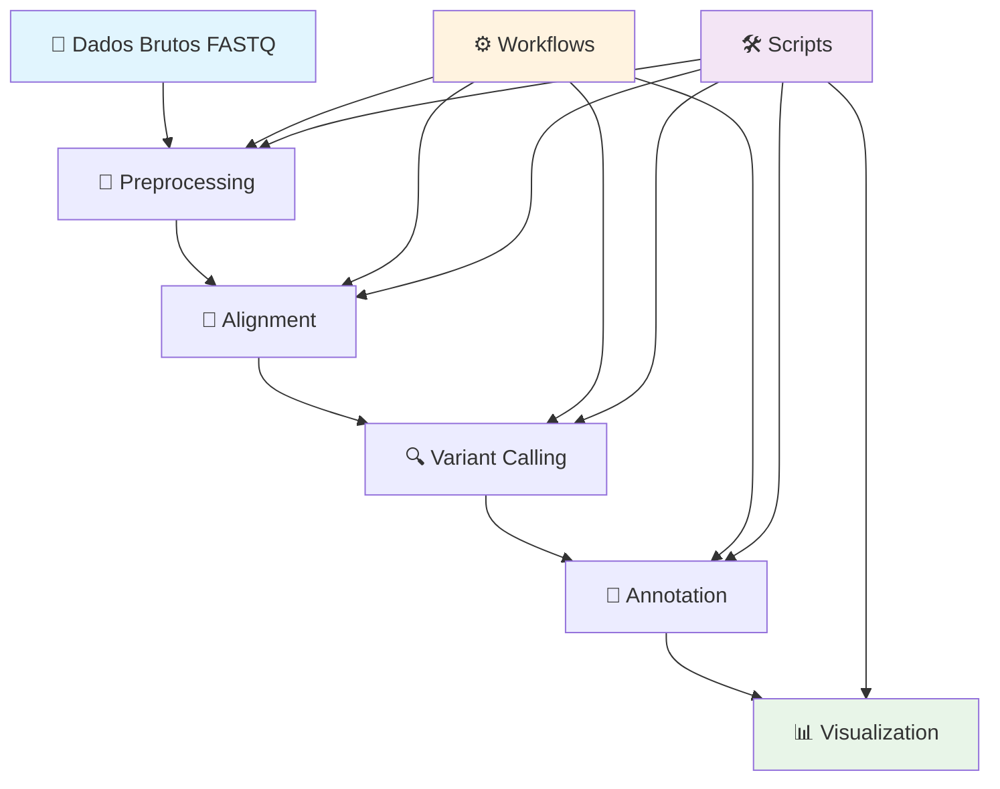

# 🧬 Genomic Data Analysis Pipeline

## 📋 Visão Geral e Arquitetura

Este pipeline de análise de dados genômicos oferece uma solução completa, modular e escalável para processamento de sequenciamento de nova geração (NGS). Implementado com tecnologias de workflow modernas (Nextflow, Snakemake, CWL), o pipeline integra as melhores práticas da bioinformática para garantir reprodutibilidade, eficiência computacional e flexibilidade analítica.

### 🎯 Objetivos Principais

• **Análise End-to-End**: Pipeline completo desde dados brutos até relatórios finais  
• **Reprodutibilidade**: Ambientes containerizados e versionamento rigoroso  
• **Modularidade**: Componentes independentes e intercambiáveis  
• **Escalabilidade**: Suporte para HPC, cloud e ambientes distribuídos  
• **Qualidade**: Controle rigoroso em todas as etapas do processo  
• **Flexibilidade**: Configurações adaptáveis para diferentes tipos de análise

### 🏗️ Arquitetura do Pipeline



## 📁 Módulos Principais

### 🔬 [Preprocessing](preprocessing/README.md)
**Controle de Qualidade e Pré-processamento**
- Análise de qualidade com FastQC e MultiQC
- Trimming adaptativo com Cutadapt e Trimmomatic
- Normalização e filtragem de reads
- Detecção de contaminação e artefatos
- Relatórios detalhados de QC

### 🧬 [Alignment](alignment/README.md)
**Alinhamento NGS e Processamento SAM/BAM**
- Alinhamento com BWA-MEM2, Bowtie2, STAR
- Processamento SAM/BAM com SAMtools e Picard
- Controle de qualidade pós-alinhamento
- Deduplicação e recalibração de bases
- Métricas de cobertura e mapeamento

### 🔍 [Variant Calling](variant_calling/README.md)
**Detecção e Filtragem de Variantes**
- Chamada de variantes com GATK HaplotypeCaller
- Filtragem avançada (VQSR, hard filtering)
- Anotação de efeitos funcionais
- Controle de qualidade de variantes
- Análise de CNVs e SVs

### 📝 [Annotation](annotation/README.md)
**Anotação Funcional e Clínica**
- Anotação com VEP, SnpEff, ANNOVAR
- Bases de dados clínicos (ClinVar, OMIM)
- Predição de patogenicidade
- Análise de vias biológicas
- Relatórios funcionais detalhados

### 🔄 [Workflows](workflows/README.md)
**Automação e Gerenciamento de Pipeline**
- Implementações Nextflow, Snakemake, CWL
- Configurações para HPC e cloud
- Monitoramento e logging
- Checkpointing e resume
- Gerenciamento de recursos

### 📊 [Visualization](visualization/README.md)
**Visualização e Relatórios**
- Dashboards interativos
- Gráficos de qualidade e cobertura
- Visualização de variantes
- Relatórios HTML automatizados
- Exportação para ferramentas externas

### 🛠️ [Scripts](scripts/README.md)
**Scripts de Automação e Utilidades**
- Scripts de inicialização e configuração
- Ferramentas de monitoramento
- Utilitários de conversão de dados
- Scripts de análise complementar
- Automação de tarefas repetitivas

## 🚀 Integração End-to-End

### Execução Completa do Pipeline

#### Usando Nextflow (Recomendado)
```bash
# Pipeline completo automatizado
nextflow run workflows/nextflow/main.nf \
  --input "data/raw/*_{R1,R2}.fastq.gz" \
  --reference references/genome.fasta \
  --outdir results/ \
  --profile hpc \
  -resume

# Com configuração personalizada
nextflow run workflows/nextflow/main.nf \
  -c config/custom.config \
  --max_cpus 32 --max_memory '128.GB' \
  --publish_dir_mode copy
```

#### Usando Snakemake
```bash
# Execução com profile de cluster
snakemake -s workflows/snakemake/Snakefile \
  --configfile config/production.yaml \
  --profile slurm \
  --jobs 100 \
  --use-singularity

# Relatório de execução
snakemake --report execution_report.html
```

### Execução Modular

```bash
# Apenas preprocessing
nextflow run workflows/nextflow/main.nf \
  --module preprocessing \
  --skip_alignment --skip_variant_calling

# Alignment + Variant Calling
snakemake alignment_all variant_calling_all \
  --cores 16

# Pipeline a partir de BAM files
nextflow run workflows/nextflow/main.nf \
  --input_bam "data/aligned/*.bam" \
  --start_from variant_calling
```

## ⚙️ Requisitos Mínimos

### Hardware
- **CPU**: Mínimo 8 cores, recomendado 16-32 cores
- **RAM**: Mínimo 32 GB, recomendado 64-128 GB
- **Storage**: Mínimo 500 GB SSD, recomendado 1-5 TB
- **Network**: Conexão estável para download de referências

### Software
- **Sistema**: Linux (Ubuntu 20.04+, CentOS 8+)
- **Python**: 3.8+
- **Conda/Mamba**: Para gerenciamento de ambientes
- **Docker/Singularity**: Para containerização
- **Nextflow**: 22.04+ ou Snakemake 7.0+

### Dados de Referência
- Genoma humano (GRCh38/hg38)
- Índices de alinhamento (BWA, Bowtie2)
- Bases de dados de anotação (dbSNP, ClinVar)
- Arquivos de recursos GATK

## 🎯 Comandos de Uso Básico

### Configuração Inicial

```bash
# Clone do repositório
git clone https://github.com/galafis/genomic-data-analysis-pipeline.git
cd genomic-data-analysis-pipeline

# Configuração do ambiente
conda env create -f environment.yml
conda activate genomics-pipeline

# Download de referências
bash scripts/setup/download_references.sh

# Configuração inicial
python scripts/setup/init_pipeline.py --config-template
```

### Execução Rápida

```bash
# Análise completa com dados de teste
bash scripts/run_test_pipeline.sh

# Pipeline personalizado
python scripts/run_pipeline.py \
  --input data/samples/ \
  --output results/ \
  --workflow nextflow \
  --profile docker

# Monitoramento em tempo real
python scripts/monitor_jobs.py --dashboard
```

### Verificação de Resultados

```bash
# Validação dos resultados
python scripts/validate_results.py \
  --results_dir results/ \
  --report validation_report.html

# Geração de relatório final
python scripts/generate_final_report.py \
  --input results/ \
  --output final_report.html
```

## 🔄 Dicas de Reprodutibilidade

### Controle de Versões
```bash
# Pipeline com versões fixas
nextflow run main.nf -r v1.0.0 \
  --conda_cache_dir /shared/conda \
  --singularity_cache_dir /shared/containers

# Relatório de reprodutibilidade
snakemake --report reproducibility_report.html \
  --software-deployment-method conda
```

### Configurações Recomendadas
- **Sempre usar containers** (Docker/Singularity)
- **Fixar versões** de software e referências
- **Documentar parâmetros** utilizados
- **Salvar logs completos** de execução
- **Usar checkpointing** para workflows longos
- **Validar resultados** contra datasets conhecidos

### Boas Práticas
- Execute dry-runs antes da análise final
- Configure limites apropriados de recursos
- Use cache compartilhado para ambientes multi-usuário
- Implemente retry automático para falhas temporárias
- Monitore uso de recursos durante execução

## 📚 Links para Documentação

### READMEs dos Módulos
- **[📁 Main Pipeline](../README.md)** - Documentação principal do projeto
- **[🔬 Preprocessing](preprocessing/README.md)** - Controle de qualidade e trimming
- **[🧬 Alignment](alignment/README.md)** - Alinhamento NGS e processamento SAM/BAM
- **[🔍 Variant Calling](variant_calling/README.md)** - Detecção e filtragem de variantes
- **[📝 Annotation](annotation/README.md)** - Anotação funcional e clínica
- **[🔄 Workflows](workflows/README.md)** - Automação e gerenciamento de pipeline
- **[📊 Visualization](visualization/README.md)** - Visualização e relatórios
- **[🛠️ Scripts](scripts/README.md)** - Scripts de automação e utilidades

### Documentação Técnica Principal
- **[⚙️ Installation Guide](../docs/installation.md)** - Guia completo de instalação e dependências
- **[🔧 Configuration Manual](../docs/configuration.md)** - Manual de configuração avançada
- **[🔍 Troubleshooting Guide](../docs/troubleshooting.md)** - Solução de problemas comuns
- **[✅ Best Practices](../docs/best_practices.md)** - Práticas recomendadas e otimização
- **[🧪 Testing Guide](../docs/testing.md)** - Guia de testes e validação
- **[📈 Performance Tuning](../docs/performance.md)** - Otimização de performance

### Recursos Adicionais
- **[📖 API Documentation](../docs/api/)** - Documentação da API interna
- **[🎓 Tutorials](../docs/tutorials/)** - Tutoriais passo-a-passo
- **[🔬 Examples](../examples/)** - Exemplos de uso e configuração
- **[❓ FAQ](../docs/faq.md)** - Perguntas frequentes
- **[📝 Changelog](../CHANGELOG.md)** - Histórico de mudanças
- **[🤝 Contributing](../CONTRIBUTING.md)** - Guia de contribuição

## 🎨 Padrão Visual do Projeto

- **Cabeçalhos Temáticos**: Emojis consistentes para identificação rápida
- **Estrutura Hierárquica**: Organização clara com navegação intuitiva
- **Blocos de Código**: Syntax highlighting com exemplos práticos
- **Listas Organizadas**: Bullets com formatação consistente
- **Links Internos**: Navegação facilitada entre módulos
- **Diagramas Mermaid**: Visualização clara da arquitetura
- **Seções Padronizadas**: Visão Geral → Implementação → Exemplos → Links

## 🔧 Suporte e Troubleshooting

### Problemas Comuns
```bash
# Limpar cache corrompido
nextflow clean -f && rm -rf work/ .nextflow/

# Verificar dependências
snakemake --list-conda-envs
nextflow info

# Validar configuração
python scripts/validate_config.py --config config/main.yaml
```

### Canais de Suporte
- **📚 Documentação**: Consulte docs/ para guias detalhados
- **🐛 Issues**: Reporte problemas no repositório GitHub
- **📋 Logs**: Verifique logs/ para debugging detalhado
- **💬 Discussions**: Participe das discussões da comunidade
- **📧 Contato**: Equipe de desenvolvimento - email@projeto.org

---

**Desenvolvido com ❤️ pela equipe de Bioinformática**  
*Pipeline Genômico - Versão 1.0.0 - 2025*
