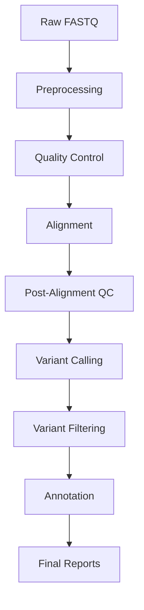

# 🔄 Workflows - Automação e Gerenciamento de Pipeline

## 📋 Visão Geral

Este módulo centraliza a automação, reprodutibilidade e gerenciamento completo do pipeline de análise de dados genômicos. Oferece implementações em múltiplas tecnologias de workflow (Nextflow, Snakemake, CWL) para garantir flexibilidade, escalabilidade e integração seamless entre todos os módulos analíticos, desde o pré-processamento até a anotação de variantes.

## 🎯 Propósito e Objetivos

• **Automação Completa**: Execução end-to-end sem intervenção manual
• **Reprodutibilidade**: Ambientes containerizados e versionamento rigoroso  
• **Gerenciamento Robusto**: Controle de recursos, logs detalhados, checkpointing
• **Modularidade**: Componentes intercambiáveis e reutilizáveis
• **Escalabilidade**: Suporte para HPC, cloud e ambientes distribuídos
• **Integração**: Conectividade entre preprocessing, alignment, variant calling e annotation

## 📁 Estrutura de Diretórios

```
src/workflows/
├── nextflow/
│   ├── main.nf
│   ├── modules/
│   │   ├── preprocessing.nf
│   │   ├── alignment.nf
│   │   ├── variant_calling.nf
│   │   └── annotation.nf
│   ├── configs/
│   │   ├── base.config
│   │   ├── hpc.config
│   │   └── cloud.config
│   └── bin/
├── snakemake/
│   ├── Snakefile
│   ├── rules/
│   │   ├── preprocessing.smk
│   │   ├── alignment.smk
│   │   ├── variant_calling.smk
│   │   └── annotation.smk
│   ├── config/
│   │   ├── config.yaml
│   │   └── samples.tsv
│   └── envs/
├── cwl/
│   ├── main-workflow.cwl
│   ├── tools/
│   │   ├── fastqc.cwl
│   │   ├── bwa-mem.cwl
│   │   └── gatk-haplotypecaller.cwl
│   └── workflows/
└── scripts/
    ├── run_pipeline.py
    ├── monitor_jobs.py
    └── generate_reports.py
```

## 🔧 Tecnologias de Workflow e Exemplos

### Nextflow (Recomendado para HPC/Cloud)

#### Execução Básica
```bash
# Pipeline completo
nextflow run workflows/nextflow/main.nf \
  --input "data/raw/*_{R1,R2}.fastq.gz" \
  --reference references/genome.fasta \
  --outdir results/ \
  --profile hpc

# Módulo específico  
nextflow run workflows/nextflow/main.nf \
  --module alignment \
  --input "data/trimmed/*_paired.fq.gz" \
  --outdir data/aligned/
```

#### Configuração Avançada
```bash
# Com resume para checkpoint
nextflow run main.nf -resume -profile docker \
  --max_cpus 32 --max_memory '128.GB' \
  --publish_dir_mode copy

# Pipeline distribuído
nextflow run main.nf -profile slurm \
  --queue_size 50 --submit_rate_limit '10/1min'
```

### Snakemake (Ideal para Reprodutibilidade)

#### Execução Local/Cluster
```bash
# Execução local
snakemake -s workflows/snakemake/Snakefile \
  --configfile config/config.yaml \
  --cores 16 --use-conda

# Cluster SLURM
snakemake -s Snakefile --profile slurm \
  --jobs 100 --cluster-config cluster.yaml \
  --use-singularity

# Dry-run para validação
snakemake --dry-run --quiet --print-compilation
```

#### Relatórios e Benchmarks
```bash
# Relatório HTML detalhado
snakemake --report report.html

# Benchmark de performance
snakemake --benchmark-repeats 3 \
  --benchmarks benchmarks/
```

### Common Workflow Language (CWL)

#### Execução com cwltool
```bash
# Workflow principal
cwltool workflows/cwl/main-workflow.cwl input.yml

# Com recursos específicos
cwltool --parallel --tmpdir-prefix /tmp/cwl \
  --cachedir cache/ main-workflow.cwl input.yml

# Toil para execução distribuída
toil-cwl-runner --batchSystem slurm \
  main-workflow.cwl input.yml
```

## ⚙️ Configurações e Parâmetros

### Arquivo de Configuração Global (config.yaml)
```yaml
# Configuração do pipeline
pipeline:
  name: "genomic-analysis-pipeline"
  version: "1.0.0"
  
# Recursos computacionais
resources:
  max_cpus: 32
  max_memory: "128GB"
  max_time: "24h"
  
# Módulos ativos
modules:
  preprocessing: true
  alignment: true
  variant_calling: true
  annotation: true
  
# Referências
references:
  genome: "references/GRCh38.fasta"
  dbsnp: "references/dbsnp.vcf.gz"
  
# Parâmetros de qualidade
qc_thresholds:
  min_read_length: 50
  min_base_quality: 20
  min_mapping_quality: 20
```

### Configuração de Amostras (samples.tsv)
```tsv
sample_id	fastq_1	fastq_2	group
SAMPLE01	data/raw/sample01_R1.fastq.gz	data/raw/sample01_R2.fastq.gz	control
SAMPLE02	data/raw/sample02_R1.fastq.gz	data/raw/sample02_R2.fastq.gz	treatment
```

## 🚀 Comandos de Execução e Integração

### Pipeline Completo End-to-End
```bash
# Nextflow - execução completa
./scripts/run_pipeline.py \
  --workflow nextflow \
  --input data/raw/ \
  --output results/ \
  --profile hpc \
  --resume

# Snakemake - pipeline modular
snakemake -s workflows/snakemake/Snakefile \
  --configfile config/production.yaml \
  --profile cluster \
  --jobs 50
```

### Execução Modular
```bash
# Apenas pré-processamento
nextflow run main.nf --module preprocessing \
  --skip_alignment --skip_variant_calling

# Alignment + Variant Calling
snakemake alignment_all variant_calling_all \
  --cores 16
```

### Monitoramento e Logs
```bash
# Monitor em tempo real
python scripts/monitor_jobs.py \
  --workflow nextflow \
  --log_dir logs/

# Relatório de progresso
nextflow log -f name,status,duration,realtime
```

## 📊 Integração com Módulos do Pipeline

### Fluxo de Dados


### Comandos de Integração
```bash
# Pipeline integrado com checkpoints
nextflow run main.nf \
  --input "data/raw/*_R{1,2}.fastq.gz" \
  --preprocessing_dir data/processed/ \
  --alignment_dir data/aligned/ \
  --variants_dir results/variants/ \
  --annotation_dir results/annotation/ \
  -resume

# Snakemake com dependências automáticas
snakemake final_report \
  --configfile config/integrated.yaml
```

## ✅ Melhores Práticas e Dicas

### Desenvolvimento e Debugging
• **Testes Unitários**: Validar cada módulo individualmente antes da integração
• **Dry Runs**: Sempre executar modo dry-run para validar dependências
• **Logging Detalhado**: Configurar logs verbosos para troubleshooting
• **Resource Profiling**: Monitorar uso de CPU/memória para otimização

### Produção e Escalabilidade
• **Containerização**: Docker/Singularity para portabilidade
• **Checkpointing**: Configurar resume automático para workflows longos
• **Resource Management**: Definir limites apropriados por processo
• **Error Handling**: Implementar retry automático e graceful failures

### Versionamento e Reprodutibilidade
```bash
# Workflow com versões fixas
nextflow run main.nf -r v1.0.0 \
  --conda_cache_dir /shared/conda \
  --singularity_cache_dir /shared/containers

# Relatório de reprodutibilidade
snakemake --report reproducibility_report.html \
  --software-deployment-method conda
```

### Performance e Otimização
```bash
# Benchmark comparativo
./scripts/benchmark_workflows.py \
  --workflows nextflow,snakemake \
  --samples config/test_samples.tsv \
  --output benchmarks/

# Otimização de recursos
nextflow run main.nf \
  --max_forks 10 \
  --queue_size 20 \
  --memory_efficient
```

## 📈 Monitoramento e Relatórios

### Dashboards em Tempo Real
```bash
# Nextflow Tower (recomendado)
nextflow run main.nf -with-tower \
  -tower.accessToken $TOWER_ACCESS_TOKEN

# Snakemake report interativo
snakemake --report interactive_report.html \
  --report-stylesheet custom.css
```

### Métricas de Performance
```bash
# Relatório de recursos
python scripts/generate_reports.py \
  --type performance \
  --input logs/ \
  --output reports/performance.html

# Análise de bottlenecks
nextflow log -f name,duration,peak_rss \
  -s duration | head -20
```

## 🔗 Links para Documentação dos Módulos

### Módulos Principais
• **[Main Pipeline README](../README.md)** - Visão geral e arquitetura do projeto
• **[Preprocessing README](../preprocessing/README.md)** - Controle de qualidade e trimming
• **[Alignment README](../alignment/README.md)** - Alinhamento NGS e processamento SAM/BAM
• **[Variant Calling README](../variant_calling/README.md)** - Detecção e filtragem de variantes
• **[Annotation README](../annotation/README.md)** - Anotação funcional e clínica

### Documentação Técnica
• **[Installation Guide](../../docs/installation.md)** - Guia de instalação e dependências
• **[Configuration Manual](../../docs/configuration.md)** - Manual de configuração avançada
• **[Troubleshooting Guide](../../docs/troubleshooting.md)** - Solução de problemas comuns
• **[Best Practices](../../docs/best_practices.md)** - Práticas recomendadas

## 🎨 Padrão Visual do Projeto

• **Cabeçalhos Temáticos**: Emojis consistentes (🔄 para workflows, 📊 para análises)
• **Estrutura Hierárquica**: Visão Geral → Tecnologias → Configuração → Integração → Práticas
• **Blocos de Código**: Syntax highlighting com linguagem específica
• **Listas Organizadas**: Bullets claros com negrito para destaque
• **Links Internos**: Navegação facilitada entre módulos relacionados
• **Diagramas**: Mermaid para fluxos de dados e arquitetura

## 🔧 Troubleshooting Comum

### Problemas de Execução
```bash
# Limpar cache corrompido
nextflow clean -f
rm -rf work/ .nextflow/

# Verificar dependências
snakemake --list-conda-envs
nextflow info
```

### Debugging de Workflows
```bash
# Modo debug detalhado
nextflow run main.nf -debug \
  -process.echo true

# Trace de execução
snakemake --debug-dag --forcerun
```

## 📞 Suporte

• **Documentação**: Consulte `docs/workflows/` para guias detalhados
• **Issues**: Reporte problemas no repositório GitHub
• **Logs**: Verifique `logs/workflows/` para debugging
• **Comunidade**: Participe das discussões no fórum do projeto
• **Contato**: Equipe de desenvolvimento - [email@projeto.org](mailto:email@projeto.org)
